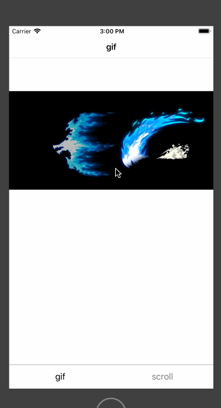

# DZMNavigationTransitionAnimation

***

仿今日头条 腾讯新闻...转场动画。抽屉式转场。

***
#### DEMO效果：



***

#### UINavigationController+DZM.h 扩展方法

```Objective-C
/// 返回手势启用(禁用)
@property(nonatomic,assign) BOOL interactivePopGestureRecognizerEnabled;

- (void)dzm_pushViewController:(UIViewController *)viewController animated:(BOOL)animated;

- (void)dzm_popViewControllerAnimated:(BOOL)animated;

- (void)dzm_popToRootViewControllerAnimated:(BOOL)animated;
```
